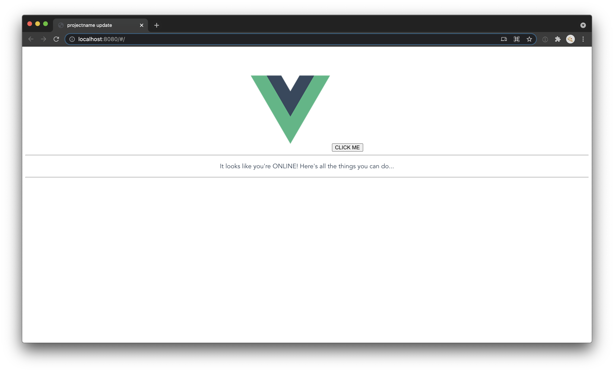

# Vue connectivity

https://www.digitalocean.com/community/tutorials/vuejs-vue-detect-online-offline

| \                | \        |
|------------------|----------|
| Deploy status    | /        |
| Deploy preview   | /        |
| Project typology | 📒  Step by step from tutorial [Online / Offline Detection with Vue.js & v-offline
](https://www.digitalocean.com/community/tutorials/vuejs-vue-detect-online-offline) |



## 🔥 Tech stack

| Purpose       | Technology   |
|:--------------|:-------------|
| Templating    | VueJS        |
| Styling       | SCSS + BEMIT |
| Documentation | Markdown     |

## 🌊 Run development mode

```shell
# install dependencies
npm i

# serve with hot reload at localhost:8080
npm run dev
```

## 🧳 Build setup

```shell
# build for production
npm run build
```

### 🌿 Branches

| Branch name | Use        |
|:------------|:-----------|
| `main`      | production |
